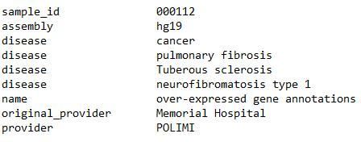

```{r, include=FALSE}
options(tinytex.verbose = TRUE)

```

# Introduction

Recent years have seen a tremendous increase in the volume of data
generated in the life sciences, especially propelled by the rapid
progress of Next Generation Sequencing (NGS) technologies. These
high-throughput technologies can produce billions of short DNA or RNA
fragments in excess of a few terabytes of data in a single run.
Next-generation sequencing refers to the deep, in-parallel DNA
sequencing technologies providing massively parallel analysis and
extremely high-throughput from multiple samples at much reduced cost.
Improvement of sequencing technologies and data processing pipelines is
rapidly providing sequencing data, with associated high-level features,
of many individual genomes in multiple biological and clinical
conditions. To make effective use of the produced data, the design of
big data algorithms and their efficient implementation on modern high
performance computing infrastructures, such as clouds, CPU clusters and
network infrastructures, is required in order to achieve scalability and
performance. For this purpose, the GenoMetric Query Language (GMQL) has
been proposed as high-level, declarative language to process, query, and
compare multiple and heterogeneous genomic datasets for biomedical
knowledge discovery [@Bioinformatics2015]

## Purpose

A very important emerging problem is to make sense of the enormous
amount and variety of NGS data becoming available, i.e., to discover how
different genomic regions and their products interact and cooperate with
each other. To this aim, the integration of several heterogeneous DNA
feature data is required. Such big genomic feature data are collected
within numerous and heterogeneous files, usually distributed within
different repositories, lacking an attribute-based organization and a
systematic description of their metadata. These heterogeneous data can
contain the hidden answers to very important biomedical questions. To
unveil them, standard tools already available for knowledge extraction
are too specialized or present powerful features, but have a rough
interface not well-suited for scientists/biologists. GMQL addresses
these aspects using cloud-based technologies (including Apache Hadoop,
mapReduce, and Spark), and focusing on genomic data operations written
as simple queries with implicit iterations over thousands of
heterogeneous samples, computed efficiently [@IEEE7484654]. This RGMQL
package makes easy to take advantage of GMQL functionalities also to
scientists and biologists with limited knowledge of query and
programming languages, but used to the R/Bioconductor environment. This
package is built over a GMQL scalable data management engine written in
Scala programming language, released as Scala API [@githubrepo]
providing a set of functions to combine, manipulate, compare, and
extract heterogenous genomic data collected both on local and remote
datasets and thus coming from different data sources. These functions,
built extending functionalities available in the R/Bioconductor
framework, allow performing complex GMQL processing and queries without
knowledge of GMQL syntax, but leveraging on R idiomatic paradigm and
logic. Additionally, RGMQL allows to use indistinctly local processing
on the user machine and remote query outsourcing (i.e. assign the
computations to a remote GMQL service), in both cases working seamlessly
on local or remote data.

# Genomic Data Model

The Genomic Data Model (GDM) is based on the notions of datasets and
samples [@modeling2016] Datasets are collections of samples, and each
sample consists of two parts, the region data, which describe portions
of the genome, and the metadata, which describe sample general
properties and how observations are collected. In contrast to other data
models, it clearly divides, and comprehensively manages, observations
about genomic regions and metadata. GDM provides a flat attribute based
organization, just requiring that each dataset is associated with a
given data schema, which specifies the attributes and their type of
region data. The first attributes of such schema are fixed (chr, start,
stop strand); they represent the genomic region identifying coordinates.
In addition, metadata have free attribute-value pair format.

## Genomic Region

Genomic region data describe a broad variety of biomolecular aspects and
are very valuable for biomolecular investigation. A genomic region is a
portion of a genome, qualified by a quadruple of values called region
coordinates: $$< chr, start, stop, strand >$$Regions can have associated
an arbitrary number of attributes with their value, according to the
processing of DNA, RNA or epigenomic sequencing reads that determined
the region.

## Metadata

Metadata describe the biological and clinical properties associated with
each sample. They are usually collected in a broad variety of data
structures and formats that constitute barriers to their use and
comparison. GDM models metadata simply as arbitrary semi-structured
attribute-value pairs, where attributes may have multiple values.

## Genomic Sample

Formally, a sample $s$ is a collection of genomic regions modelled as
the following triple: $$< id, {< r_i,v_i >}, {m_j} >$$ where:

-   $id$ is the sample identifier
-   Each region is a pair of coordinates $r_i$ and values $v_i$
-   Metadata $m_j$ are attribute-value pairs $< a_j,v_j >$

Note that the sample $id$ attribute provides a many-to-many connection
between regions and metadata of a sample. Through the use of a data type
system to express region data, and of arbitrary attribute-value pairs
for metadata, GDM provides interoperability across datasets in multiple
formats produced by different experimental techniques.

## Dataset

A dataset is a collection of samples uniquely identified, with the same
region schema and with each sample consisting of two parts:

-   region data: describing characteristics and location of genomic
    portions
-   metadata: expressing general properties of the sample

Each dataset is typically produced within the same project by using the
same or equivalent technology and tools, but with different experimental
conditions, described by metadata.

Datasets contain large number of information describing regions of a
genome, with data encoded in human readable format using plain text
files.

GMQL datasets are materialized in a standard layout composed of three
types of files:

1.  genomic region tab-delimited text files with extension .gdm, or .gtf
    if in standard GTF format
2.  metadata attribute-value tab-delimited text files with the same
    fullname (name and extension) of the correspondent genomic region
    file and extension .meta
3.  schema XML file containing region attribute names and types

All these files reside in a unique folder called $files$.

<!--  -->

In RGMQL package, dataset files are considered read-only. Once read,
genomic information is represented in an abstract data structure inside
the package, mapped to a R GRanges data structure as needed for optimal
use and interoperability with all available R/Bioconductor functions.

# GenoMetric Query Language

The GenoMetric Query Language name stems from such language ability to
deal with genomic distances, which are measured as number of nucleotide
bases between genomic regions (aligned to the same reference genome) and
computed using arithmetic operations between region coordinates. GMQL is
a high-level, declarative language that allows expressing queries easily
over genomic regions and their metadata, in a way similar to what can be
done with the Structured Query Language (SQL) over a relational
database. GMQL approach exhibits two main differences with respect to
other tools based on Hadoop, mapReduce framework, and Spark engine
technologies to address similar biomedical problems:

-   GMQL:

    1.  reads from processed datasets
    2.  supports metadata management

-   Others:

    1.  read generally from raw or aligned data from NGS machines
    2.  provide no support for metadata management

GMQL is the appropriate tool for querying many genomic datasets and very
many samples of numerous processed genomic region data that are becoming
available. Note however that GMQL performs worse than some other
available systems on a small number of small-scale datasets, but these
other systems are not cloud-based; hence, they are not adequate for
efficient big data processing and, in some cases, they are inherently
limited in their data management capacity, as they only work as RAM
memory resident processes.

## GMQL Query Structure

A GMQL query, or script, is expressed as a sequence of GMQL operations
with the following structure:
$$< variable > = operator(< parameters >) < variable >;$$ where each
$< variable >$ stands for a GDM dataset

This RGMQL package brings GMQL functionalities into R environment,
allowing users to build directly a GMQL query without knowing the GMQL
syntax, but using R idiomatic expressions and available R functions
suitably extended. In RGMQL every GMQL operations is translated into a R
function and expressed as:
$$ variable = operator(variable, parameters)$$

It is very similar to the GMQL syntax for operation expression, although
expressed with the R idiomatic paradigm and logic, with parameters
totally built using R native data structures such as lists, matrices,
vectors or R logic conditions.

# Processing Environments

In this section, we show how GMQL processing is built in R, which
operations are available in RGMQL, and the difference between local and
remote dataset processing.

## Local Processing {#local-processing}

RGMQL local processing consumes computational power directly from local
CPUs/system while managing datasets (both GMQL or generic text plain
datasets).

### Initialization

Load and attach the RGMQL package in a R session using library function:

```{r, initialization}
library('RGMQL')
```

RGMQL depends on another package called *RGMQLlib* automatically
installed when installing *RGMQL* and loaded each time *RGMQL* is loaded
; if not, you can install it from Bioconductor and load it using:

```{r, initialization_RGMQLlib}
library('RGMQLlib')
```

Before starting using any GMQL operation we need to initialise the GMQL
context with the following code:

```{r, init}
init_gmql()
```

The function *init_gmql()* initializes the context of scalable data
management engine laid upon Spark and Hadoop, and the format of
materialized result datasets. Details on this and all other functions
are provided in the R documentation for this package (i.e.,
help(RGMQL)).

### Read Dataset

After initialization, we need to read datasets. We already defined above
the formal definition of dataset and the power of GMQL and its Genomic
Data Model to deal with data in a variety of common tab-delimited text
formats, among which SAM (Sequence Alignment/Map), VCF (Variant Call
Format), NARROWPEAK (for called peaks produced by NGS ChIP-seq or
DNase-seq methods) and BED (Browser Extensible Data) formats, as well
all the formats describing experimental datasets (e.g., copy number
variations, DNA somatic mutations, or gene expressions) and annotations
(e.g., about transcription start sites, genes, enhancers or CpG
islands).

In the following, we show how to get data from different sources.

We distinguish two different cases:

1.  Local dataset:\newline A local dataset is a folder with sample files
    (region files and correspondent metadata files) on the user
    computer. As data are already in the user computer, we simply
    execute:

```{r, read GMQL dataset}
gmql_dataset_path <- system.file("example", "EXON", package = "RGMQL")
data_out = read_gmql(gmql_dataset_path)
```

In this case we are reading a GMQL dataset specified by the path of its
folder "EXON" within the subdirectory "example" of the package "RGMQL".
It does not matter what kind of format the data are, *read_gmql()* reads
many standard tab-delimited text formats without the need of specifying
any additional input parameter.

2.  GRangesList:\newline For better integration in the R environment and
    with other R packages, we provide the *read_GRangesList()* function
    to read directly from R memory using GRangesList as input.

```{r, read GRangesList}
library("GenomicRanges")

# Granges Object with one region: chr2 and two metadata columns: score = 5 
# and GC  = 0.45

gr1 <- GRanges(seqnames = "chr2",
    ranges = IRanges(103, 106), strand = "+", score = 5, GC = 0.45)

# Granges Object with two regions both chr1 and two metadata columns: score = 3
# for the fist region and score = 4 for the second one, GC  = 0.3 and 0.5 
# for the first and second region, respectively

gr2 <- GRanges(seqnames = c("chr1", "chr1"),
    ranges = IRanges(c(107, 113), width = 3), strand = c("+", "-"),
    score = 3:4, GC = c(0.3, 0.5))

grl <- GRangesList("txA" = gr1, "txB" = gr2)
data_out <- read_GRangesList(grl)
```

In this example we show how versatile the RGMQL package is. As specified
above, we can directly read a list of GRanges previously created
starting from two GRanges. Both *read_GRangesList()* and *read_gmql()*
functions return a result object, in this case *data_out*: an instance
of GMQLDataset class used as input for executing the subsequent GMQL
operation.\newline NOTE: if grl\@*metadata* is empty, the function
provides two default metadata:

-   "provider" = "PoliMi"
-   "application" = "RGMQL"

### Queries

GMQL is not a traditional query language: With "query" we intend a group
of operations that together produce a result; in this sense GMQL queries
are more similar to SQL scripts. GMQL programming consists of a series
of select, union, project, difference (and so on ...) commands.

Let us see a short example:

Find somatic mutations in exon regions. Consider mutation data samples
of human breast cancer cases. For each sample, quantify the mutations in
each exon and select the exons with at least one mutation. Return the
list of samples ordered by the number of such exons.

```{r, query}

# These statements define the paths to the folders "EXON" and "MUT" in the 
# subdirectory "example" of the package "RGMQL"

exon_path <- system.file("example", "EXON", package = "RGMQL")
mut_path <- system.file("example", "MUT", package = "RGMQL")

# Read EXON folder as a GMQL dataset named "exon_ds" containing a single 
# sample with exon regions, and MUT folder as a GMQL dataset named "mut_ds" 

exon_ds <- read_gmql(exon_path)
mut_ds <- read_gmql(mut_path)

# Filter out mut_ds based on a metadata predicate to keep breast cancer 
# mutations only

mut = filter(mut_ds, manually_curated__dataType == 'dnaseq' & 
                clinical_patient__tumor_tissue_site == 'breast')

# Filter out exon_ds based on a metadata predicate to keep Refseq exons only

exon = filter(exon_ds, annotation_type == 'exons' & 
                    original_provider == 'RefSeq')

# For each mutation sample, map the mutations to the exon regions using 
# the map() function and count mutations within each exon storing the value
# in the default region attribute 'count_left_right'

exon1 <- map(exon, mut)

# Remove exons in each sample that do not contain mutations

exon2 <- filter(exon1, r_predicate = count_left_right >= 1)

# Using the extend() function, count how many exons remain in each sample and
# store the result in the sample metadata as a new attribute-value pair, 
# with exon_count as attribute name 

exon3 <- extend(exon2, exon_count = COUNT())

# Order samples in descending order of the added metadata exon_count 

exon_res = arrange(exon3, list(DESC("exon_count")))
```

If you want to store persistently the result, you can materialize it
into a specific path defined as input parameter.

```{r, materialize}
# Materialize the result dataset on disk
collect(exon_res)
```

By default *collect()* has R working directory as storing path and *ds1*
as name of resulted dataset folder. Alternatively, we can specificy a
different storing path and folder name as follows.+

```{r, materializeElsewhere}
# Materialize the result dataset into a specific folder on disk
collect(exon_res, dir_out = "./WD_R", name = "dataset") #, 
```

### Execution

RGMQL processing does not generate results until you invoke the
*execute()* function.

```{r, execute, eval = FALSE}
execute()
```

*execute()* can be issued only if at least one *read()* and at least one
*collect()* are present in the RGMQL query, otherwise an error is
generated. Data are saved in the path specified in every *collect()*
present in the query. After the execution, the context of scalable data
management engine is stopped and a new invocation of *init_gmql()* is
needed.

Alternatively to or before *execute()* we can use:

```{r, take,eval=FALSE}
g <- take(exon_res, rows = 45)
```

to execute all the RGMQL coomands and extract data as GRangesList format
in main memory. Specifically a GRangesList for each dataset and a
GRanges for each sample is obtained.

NOTE: take() function works in local processing only and does not
require a previous collect() function. Yet, GRangesList are contained in
the R environment and are not saved on disk: *collect()* and *execute()*
functions are needed to save data in mass memory

With the *rows* parameter it is possible to specify how many rows, for
each sample inside the input dataset, are extracted; by default, the
*rows* parameter value is $0$, that means all rows are extracted. Note
that, when dealing with big data, extracting all rows could be time
demanding and very space consuming in main memory.

## Remote Processing {#remote-processing}

RGMQL remote processing consumes computational power from remote
cluster/system while managing GMQL datasets.\newline

Remote processing exists in two flavour:

-   REST web services: \newline User can write GMQL queries (using
    original GMQL syntax) to be executed remotely on remote data (or
    local data previously uploaded).

-   Sequential execution: \newline Similar to local execution; user
    reads data and the system automatically uploads them on the remote
    system if they are not already there; once loaded, RGMQL functions
    can be issued to manage and process remote data.

### REST Web Services

This RGMQL package allows invoking REST services that implement the
commands specified at [link](http://www.gmql.eu/gmql-rest/swagger).

#### Initialization

GMQL REST services require login; so, the first step is to perform login
with user and password, or as guest. Upon successful logon, you get a
request token that you must use in every subsequent REST call. Login can
be performed using the *login_gmql()* function as a guest:

```{r, init with guest login}
test_url = "http://www.gmql.eu/gmql-rest"
login_gmql(test_url)
```

Alternatively, login can be performed specifying previously defined user
name and password, as to access each time the same private space on the
GMQL remote repository. To create a new user registration, it is enough
to use *register_gmql()*, specyfing all the needed parameters.

```{r, init with login}
test_url = "http://www.gmql.eu/gmql-rest"
login_gmql(test_url, username = 'myname', password = 'mypassword')
```

Login saves a token in the Global R environment within the variable
named *authToken*. With this token you can call all the functions in the
GMQL REST Web services suite.

#### Execution

User can write a GMQL query as in the following example, and run it as
second parameter of the *run_query()* function:

```{r, run, eval = FALSE}

job <- run_query(test_url, "query_1", "DNA = SELECT() Example_Dataset_1; 
MATERIALIZE DNA INTO RESULT_DS;", output_gtf = FALSE)

```

Or the user can execute a query reading it directly from file (e.g., the
"query1.txt" file in the "example" subdirectory of the RGMQL package):

```{r, run_from_file, eval = FALSE}
query_path <- system.file("example", "query1.txt", package = "RGMQL")
job <- run_query_fromfile(test_url, query_path, output_gtf = FALSE)
```

Once run, query continues on the remote server while *run_query()* or
*run_query_fromfile()* returns immediately. User can extract from result
(job) the job_id and status. jod_id can then be used to continuously
invoke log and trace calls, both in this RGMQL package, to check for job
completed status.

```{r, trace, eval = FALSE}
job_id <- job$id
trace_job(test_url, job_id)
```

Then, results materialized on the remote repository can be downloaded
locally and imported in GRangesList using the functions in this RGMQL
package [(see Import/Export)](#utilities).

The returned *job* contains also the name of the created datasets, one
for each materialize in the GMQL query run, in the same order; the first
can be downloaded locally with:

```{r, download, eval = FALSE}
name_dataset <- job$datasets[[1]]$name
download_dataset(test_url, name_dataset)

```

By default *download_dataset()* has R working directory as local storing
path.

Downloaded result dataset can be then imported and used in the R
environment as GRangesList [(see Import/Export)](#utilities).
Alternatively, the remote result dataset can be directly downloaded and
imported in the R environment as GRangesList using the function
*download_as_GRangesList()*:

```{r, download_as_GRangesList, eval=FALSE}
name_dataset <- job$datasets[[1]]$name
grl = download_as_GRangesList(test_url, name_dataset)
```

Once download is done, we can logout from remote repository using:

```{r, logout}
logout_gmql(test_url)
```

*logout_gmql()* deletes the $authToken$ from R environment.

### Sequential Execution

This execution type is similar to local processing (syntax, functions,
and so on ...) except that materialized data are stored only on the
remote repository, from where they can be downloaded locally and
imported in GRangesList using the functions in this RGMQL package [(see
Import/Export)](#utilities).

Before starting with an example, note that we have to log into remote
infrastructure with *login_gmql()* function:

```{r, login remote, eval = FALSE}
test_url = "http://www.gmql.eu/gmql-rest"
login_gmql(test_url)
```

Otherwise, we can initialize the data engine with a remote url:

```{r, initialize remote}
init_gmql(url = test_url)
```

In this way login is automatically performed as specified above while,
by default, remote processing mode is set to FALSE. Thus, to proceed
with query outsourcing we have to change to remote processing after
initialization:

```{r, change processing mode}
remote_processing(TRUE)
```

Alternatively, instead of switching mode, we can initialize the data
engine by setting remote processing as TRUE, in the corresponding
*init_gmql* parameter:

```{r, init remote processing }
init_gmql(url = test_url, remote_processing = TRUE)
```

Once done, we can start building the query that will be processed
remotely:

```{r, remote query}

## Read the remote dataset HG19_TCGA_dnaseq
## Read the remote dataset HG19_BED_ANNOTATION

TCGA_dnaseq <- read_gmql("public.HG19_TCGA_dnaseq", is_local = FALSE)
HG19_bed_ann <- read_gmql("public.HG19_BED_ANNOTATION", is_local = FALSE)

# Filter out mut_ds based on a metadata predicate to keep breast cancer 
# mutations only

mut = filter(TCGA_dnaseq, manually_curated__dataType == 'dnaseq' & 
                clinical_patient__tumor_tissue_site == 'breast')

# Filter out exon_ds based on a metadata predicate to keep Refseq exons only 

exon = filter(HG19_bed_ann, annotation_type == 'exons' & 
                    original_provider == 'RefSeq')

# For each mutation sample, map the mutations to the exon regions using 
# the map() function and count mutations within each exon storing the value
# in the default region attribute 'count_left_right'

exon1 <- map(exon, mut)

# Remove exons in each sample that do not contain mutations

exon2 <- filter(exon1, r_predicate = count_left_right >= 1)

# Using the extend() function, count how many exons remain in each sample and
# store the result in the sample metadata as a new attribute-value pair, 
# with exon_count as attribute name 

exon3 <- extend(exon2, exon_count = COUNT())

# Order samples in descending order of the added metadata exon_count 

exon_res = arrange(exon3, list(DESC("exon_count")))
```

N.B. In case of remote processing, for *collect()* function we have to
specify the name of the output dataset (not necessarily the same as
input) as the second parameter in order to correctly process the query
on the remote GMQL system. Here it is the needed R code:

```{r, remote materialize, eval = FALSE}
collect(exon_res, name="exon_res_data")
```

```{r, remote execute, eval = FALSE}
job<-execute()
```

In this case R processing continues until the remote processing ends.
With remote processing, after the execution, the context of the scalable
data management engine is not stopped, and can be used for further
queries. Materialized datasets are stored only remotely, from where they
can be downloaded and stored on local disk:

```{r, download_2, eval = FALSE}
name_dataset <- job$datasets[[1]]$name
download_dataset(test_url, name_dataset)
```

and/or directly imported into the R environment as GRangesList using the
function *download_as_GRangesList()*:

```{r, download_as_GRangesList_2, eval=FALSE}
name_dataset <- job$datasets[[1]]$name
grl = download_as_GRangesList(test_url, name_dataset)
```

Additionally, any dataset previously downloaded and stored locally can
be then imported in the R environment as GRangesList [(see
Import/Export)](#utilities).

In any case, once download is done, we can logout from remote repository
using:

```{r, logout_2, eval=FALSE}
logout_gmql(test_url)
```

## Mixed Processing

As said before, the processing mode can be switched using the function:

```{r, switch mode}
test_url = "http://www.gmql.eu/gmql-rest"
init_gmql(url = test_url)
remote_processing(TRUE)
```

An user can switch processing mode until the first *collect()* has been
performed.

This kind of processing comes from the fact that the *read_gmql()*
function can accept either a local dataset or a remote repository
dataset, even in the same query as in the following example:

```{r, mixed query}


# This statement defines the path to the folder "MUT" in the subdirectory 
# "example" of the package "RGMQL"

mut_path <- system.file("example", "MUT", package = "RGMQL")

# Read MUT folder as a GMQL dataset named "mut_ds" 

mut_ds <- read_gmql(mut_path, is_local = TRUE)

# Read the remote dataset HG19_BED_ANNOTATION

HG19_bed_ann <- read_gmql("public.HG19_BED_ANNOTATION", is_local = FALSE)

# Filter out mut_ds based on a metadata predicate to keep breast cancer 
# mutations only

mut = filter(mut_ds, manually_curated__dataType == 'dnaseq' & 
                clinical_patient__tumor_tissue_site == 'breast')

# Filter out exon_ds based on a metadata predicate to keep Refseq exons only 

exon = filter(HG19_bed_ann, annotation_type == 'exons' & 
                    original_provider == 'RefSeq')

# For each mutation sample, map the mutations to the exon regions using 
# the map() function and count mutations within each exon storing the value
# in the default region attribute 'count_left_right'

exon1 <- map(exon, mut)

# Remove exons in each sample that do not contain mutations

exon2 <- filter(exon1, r_predicate = count_left_right >= 1)

# Using the extend() function, count how many exons remain in each sample and
# store the result in the sample metadata as a new attribute-value pair, 
# with exon_count as attribute name 

exon3 <- extend(exon2, exon_count = COUNT())

# Order samples in descending order of the added metadata exon_count 

exon_res = arrange(exon3, list(DESC("exon_count")))

```

Materialize result:

```{r, mixed materialize, eval = FALSE}
collect(exon_res,"exon_result_dataset")
```

Execute processing:

```{r, mixed execute, eval = FALSE}
job<-execute()
```

As we can see, the two *read_gmql()* functions above read from different
sources: *mut_ds* from local dataset, *HG19_BED_ANNOTATION* from remote
repository.

If we set remote processing to false (*remote_processing(FALSE)*), the
execution is performed locally downloading first all needed datasets
from the GMQL remote repository; otherwise, all local datasets are
automatically uploaded to the remote GMQL repository associated with the
remote system where the processing is performed. In this latter case,
materialized datasets are stored on the remote repository, from where
they can be downloaded and imported into the R environment like in the
two previous remote processing scenarios [(see Remote
Processing)](#remote-processing).

NOTE: The public datasets cannot be downloaded entirely from the remote
GMQL repository by design.

# Utilities {#utilities}

The RGMQL package contains functions that allow the user to interface
with other packages available in R/Bioconductor repository, e.g.,
GenomicRanges, cBioPortalData, TFHAZ, TFARM. Some of RGQML functions are
developed to directly provide extensibility over core data structures
and processing functions commonly used in the R/Bioconductor
environment, such as most of the manipulation functions provided by
dyplr package. Some other functions can return or read GRangesList or
GRanges objects with associated metadata (if present), and such data
structures are suitable to further processing by a variety of other
R/Bioconductor packages.

## Import/Export

We can import a GMQL dataset into R environment as follows:

```{r, import}
# This statement defines the path to the folder "EXON" in the subdirectory 
# "example" of the package "RGMQL"

dataset_path <- system.file("example", "EXON", package = "RGMQL")

# Import the GMQL dataset EXON as GRangesList

imported_data <- import_gmql(dataset_path, is_gtf = FALSE)
imported_data

# and its metadata

imported_data@metadata

```

The second parameter *is_gtf* must specify the file format: .GTF or
.GDM.

We can export a GRangesList as a GMQL dataset as follows:

```{r, export}
# This statement defines the path to the subdirectory "exp" of the 
# package "RGMQL"

dir_out <- paste(system.file("example", package = "RGMQL"), 'exp', sep='/')

# Export the GRangesList 'imported_data' as GMQL dataset called 'example' 
# at destination path

export_gmql(imported_data, dir_out, is_gtf = TRUE)
```

The second parameter *is_gtf* must specify the file format: .GTF or
.GDM.

## Filter and Extract

We can also import only a part of a GMQL dataset into R environment, by
filtering its content based on metadata and/or region attributes.
Following, we extract from a gene expression dataset of adrenocortical
carcinoma patients all the sample profiles, but focusing only on the
raw count expression values.

```{r, filter_extract}
# This statement defines the path to the folder "TCGA-ACC" in the subdirectory 
# "example" of the package "RGMQL"

data_in <- system.file("example", "TCGA-ACC", package = "RGMQL")

matrix <- filter_and_extract(data_in, metadata= NULL,
                             region_attributes = 
                               FULL(except = c('fpkm_uq','fpkm')))
matrix

```

*filter_and_extract()* filters the samples in the input dataset based on
the specified *metadata* attributes of interest and then, for each
filtered sample, extracts the GRanges coordinate attributes (seqnames,
start, stop, strand) together with other *region_attributes* specified
to be retrieved and kept from the input dataset (possibly all if
$region\_attributes$ = FULL(except = NULL)). If the $metadata$ argument
is NULL, all samples are taken without filtering. If
$region\_attributes$ is not specified, only the fundamental elements of
GRanges are extracted, i.e., the genomic coordinates.

Any additional region attribute from $region\_attributes$ is a metadata
column of the GRanges obtained for each filtered sample. The total
number of obtained columns is equal to the number of samples left after
filtering, multiplied by the number of specified region attributes.

NOTE: *filter_and_extract()* works only if every sample in the dataset
includes the same number of regions with the same coordinates.

Each metadata column is named using *region_attributes* concatenated
with the function input parameter *suffix*. By default *suffix*
correspond to a metadata: *antibody_target*.

## Metadata

Each sample of a GMQL dataset has its own metadata associated and
generally every metadata attribute has a single value. An example of
distinct values for the same metadata attribute is shown in the figure
below for the \emph{disease} metadata attribute. We suppose that more
than one disease is associated to each sample, for which annotations to
indicate over-expressed genes are provided.

\newline\newline
 
\newline\newline 

In this case GMQL automatically handles this situation. In the
Import/export paragraph, we showed that a GMQL dataset can be imported
into R environment as a GRangesList, together with its metadata.

```{r, metadata}
# This statement defines the path to the folder "DATASET_META" in the 
# subdirectory "example" of the package "RGMQL"

dataset_path <- system.file("example", "DATASET_META", package = "RGMQL")

# Import the GMQL dataset DATASET_META as GRangesList

grl_data <- import_gmql(dataset_path, is_gtf = FALSE)
grl_data

# and its metadata

grl_data@metadata

```

The metadata are stored as simple list in the form key-values and it
does not matter if mutiple values for the same metadata attribute are
present; all values are stored and shown. Difficulties can arise when we
need to get all the metadata values; normally, since the metadata list
is in the form key-value, we can extract the metadata values using:

```{r, retrieve_value}

# store metadata on variable a

a = grl_data@metadata

# get disease value of sample S_00000

a$S_00000$disease

```

Yet, in this case only the first disease value is shown. If we want to
retrieve all disease values, we should use instead:

```{r, retrieve_values}

# get all disease values of sample S_00000

a$S_00000[which(names(a$S_00000) %in% "disease")]

```

# Windows OS Issues

Be aware that during a [local processing](#local-processing) execution
an error message

``` {{}
Error in .jcall("RJavaTools", "Ljava/lang/Object;", "invokeMethod", cl, 
: org.apache.spark.SparkException: Job aborted due to stage failure: 
Task 0 in stage 7.0 failed 1 times, most recent failure: 
Lost task 0.0 in stage 7.0 (TID 59, localhost, executor driver): 
java.io.IOException: (null) entry in command string: null chmod 0644 
```

may arise.

This happens because some Hadoop binary files are missing in Windows
64Bits. In this case we need to:

-   Go to <https://github.com/steveloughran/winutils>, download the
    repository
-   Create a directory 'hadoop' with a sub-directory 'bin' in a path of
    your choice (for example at `C:\Program Files\hadoop\bin`).
-   Copy the files from the repository folder **hadoop-2.8.1** into the
    'bin' sub-directory earlier created.
-   Create an environment variable HADOOP_HOME with value equals to the
    path reaching the 'bin' directory where you just copied the files.
    

# References
