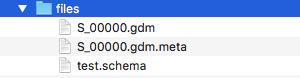

# Introduction

Improvement of sequencing technologies and data processing pipelines is rapidly providing sequencing data, with associated high-level features, of many individual genomes in multiple biological and clinical conditions.\newline
For this purpose GMQL has been proposed a high-level, declarative GenoMetric Query Language (GMQL) and a toolkit for its use.

## Purpose

This package provides a set of functions to create, manipulate and extract genomic data from different datasources from local and remote datasets.\newline
Also, these functios allow performing complex queries without the knowledge of GMQL syntax.

# Dataset

We usually distinguish two kinds of dataset layout:\newline
These contains large number of information describing regions of genome.\newline
Data are encoded in human readable format using plain text file.

- GMQL standard layout :\newline\newline
  Dataset is composed basically of three type of file:
  
	1) region files usually terminating in .gtf or .gdm
	2) metadata files terminating in .meta
	3) schema XML file containing regions attributes
\newline\newline
	Each region sample file owns its metadata file.
	All these files must reside in unique folder called files.
	

	
- Generic text based dataset:\newline\newline
  Dataset composed by heterogeneous sample organised in simple text files probably 
	stem from different medical, biological sytem
	Sample files are simply contained on a folder whose name must be 
	specified as input on read function.
	\newline

In our package dataset files are considered read-only.
Once read genomic information is represented in abstract structure inside 
package.


# Basic Requirements
	
- javaEE version 8 
- java environment correctly set (i.e JAVA_HOME)
- scala version 2.11.8
- scala environment correctly set (i.e SCALA_HOME)
- network connectivity to web services (if required)
	
# How to Install
	
The GMQL package can be installed by executing the following R expression.
```{r, eval=FALSE}
source("https://bioconductor.org/biocLite.R")
biocLite("GMQL")
```
  
# Processing Environments

This package allow to create, manipulate and extract genomic data from 
different datasets using different processing modes.

## Local Environment

Query processing consumes computational power directly from local CPUs/system while
managing datasets (both GMQL or generic text plain dataset).
In case of remote datasets, user have to download it locally using 
specifying function:
	
```{r, eval=FALSE}
test_url = "http://130.186.13.219/gmql-rest"
login.GMQL(test_url)
downloadDataset(test_url,"dataset_test",path = getwd())
```
Once local, these datatset behave like local dataset as written above.
In every case local processing saves results on local disk in the folder.

## Remote Environment

Query processing consumes computational power from remote clusters/system while
managing datasets that are only GMQL dataset.\newline
Rest servicies required login so the first step is to perform logon
using user and password or as guest.
Upon succesfull logon you get a request token must use in every subsequent REST call.
Login can be performed using function:
```{r, eval=FALSE}
test_url = "http://130.186.13.219/gmql-rest"
login.GMQL(test_url)
```
that saves token in R environment.\newline
Remote processing exits in two flavour:\newline

- BATCH execution: \newline
  Once user read data the system automatically upload it on remote system:
	once loaded you can isue R function to manage remote data.\newline
	
- REST web services: \newline
  user can write GMQL queries to be executed remotely on remote data (or local data previous upload)


Saved data will be stored in repository and eventually can be downloaded locally.

# Local Environment 

## Datasource

## Queries

## Execution


# More Example


