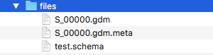

# Introduction

Recent years have seen a tremendous increase in the volume of data generated 
in the life sciences, especially propelled by the rapid progress of 
Next Generation Sequencing (NGS) technologies. 
This high-throughput technologies can produce billions of short DNA or RNA 
fragments in excess of a few terabytes of data in a single run.
Next-generation sequencing refers to the deep, in-parallel DNA sequencing 
technologies providing massively parallel analysis and extremely 
high-throughput from multiple samples at much reduced cost. 
Improvement of sequencing technologies and data processing pipelines 
is rapidly providing sequencing data, with associated high-level features, 
of many individual genomes in multiple biological and clinical conditions. 
To make effective use of the produced data, the design of big data algorithms 
and their efficient implementation on modern high performance 
computing infrastructures, such as clouds, CPU clusters 
and network infrastructures, is required in order to achieve scalability 
and performance. 
For this purpose the GenoMetric Query Language (GMQL) has been proposed 
as high-level, declarative language to process, query, 
and compare multiple and heterogeneous genomic datasets for biomedical 
knowledge discovery [@Bioinformatics2015]

## Purpose

A very important emerging problem is to make sense of the enormous amount and 
variety of NGS data becoming available, i.e. to discover how different genomic 
regions and their products interact and cooperate with each other. 
To this aim, the integration of several heterogeneous DNA feature data 
is required.
Such big genomic feature data are collected within numerous and 
heterogeneous files, usually distributed within different repositories, 
lacking an attribute-based organization and a systematic description 
of their metadata. 
These heterogeneous data can contain the hidden answer to very important 
biomedical questions.
To inveil them, standard tools already available for knowledge extraction 
are too specialized or present powerful features, but have a rough interface 
not well-suited for scientists/biologists.
GMQL addresses these aspects using cloud-based technologies 
(including Apache Hadoop, mapReduce, and Spark), and focusing on genomic data 
operations written as simple queries with implicit iterations over thousands 
of heterogeneous samples, computed efficiently [@IEEE7484654].
This RGMQL package makes easy to take advantage of GMQL functionalities also 
to scientists and biologists with limited knowledge of query and 
programming languages, but used to the R/Bioconductor environment. 
This package is built over a GMQL scalable data management engine 
written in Scala programming language, released as Scala API [@githubrepo] 
providing a set of functions to combine, manipulate, compare, and extract 
genomic data from different datasources both from local and remote datasets.
These functions allow performing complex GMQL processing and queries without 
knowledge of GMQL syntax, but leveraging on R idiomatic paradigm and logic.


# Genomic Data Model

The Genomic Data Model (GDM) is based on the notions of datasets 
and samples[@modeling2016] 
Datasets are collections of samples, and each sample consists of two parts, 
the region data, which describe portions of the genome, and the metadata, 
which describe sample general properties and how observations are collected.
In contrast to other data models, it clearly divides, and comprehensively 
manages, observations about genomic regions and metadata.
GDM provides a flat attribute based organization, just requiring that 
each dataset is associated with a given data schema, which specifies 
the attributes and their type of region data.
The first attributes of such schema are fixed (chr, start, end, strand); 
they represent the genomic region identifying coordinates.
In addition, metadata have free attribute-value pair format.

## Genomic Region 

Genomic region data describe a broad variety of biomolecular aspects and are 
very valuable for biomolecular investigation.
A genomic region is a portion of a genome, qualified by a quadruple of values 
called region coordinates:
$$< chr, left, right, strand >$$
Regions can have an arbitrary number of associated values, according to 
the processing of DNA, RNA or epigenomic sequencing reads that determined 
the region.

## Metadata

Metadata describe the biological and clinical properties associated with 
each sample.
They are usually collected in a broad variety of data structures and formats 
that constitute barriers to their use and comparison GDM models metadata 
simply as arbitrary semi-structured attribute-value pairs, 
where attributes may have multiple values.

## Genomic Sample

Formally, a sample s is a collection of genomic regions modeled as 
the following triple: $$< id, {< r_i,v_i >}, {m_j} >$$ where:

* id is the sample identifier
* Each region is a pair of coordinates $r_i$ and values $v_i$
* Metadata $m_j$ are attribute-value pairs $< a_j,v_j >$

Note that the sample id attribute provides a many-to-many connection between 
regions and metadata of a sample.
Through the use of a data type system to express region data, and of arbitrary 
attribute-value pairs for metadata, GDM provides interoperability across 
datasets in multiple formats produced by different experimental techniques.

## Dataset

A dataset is a collection of samples uniquely identified, with the same region 
schema and with each sample consisting of two parts:

* region data: describing characteristics and location of genomic portions
* metadata: expressing general properties of the sample

Each dataset is typically produced within the same project by using the same 
or equivalent technology and tools, but with different experimental 
conditions, described by metadata.

Datasets contain large number of information describing regions of a genome, 
with data encoded in human readable format using plain text files.

GMQL datasets are materialized in a standard layout composed of three 
types of files:

1. genomic region tab-delimited text files with extension .gdm, or .gtf 
if in standard GTF format
2. metadata attribute-value tab-delimited text files with the same fullname 
(name and extension) of the correspondent region file and extension .meta
3. schema XML file containing region attribute names and types

All these files reside in unique folder called files.

<!--  -->

In RGMQL package dataset files are considered read-only.
Once read, genomic information is represented in abstract structure inside 
the package, mapped to a R GRanges data structure at occurency.


# GenoMetric Query Language

The GenoMetric Query Language name stems from the language ability to deal 
with genomic distances, which are measured as number of nucleotide bases 
between genomic regions (aligned to the same reference genome) and computed 
using arithmetic operations between region coordinates.
GMQL is a high-level, declarative language that allows expressing queries 
easily over genomic regions and their metadata, in a way similar to what can 
be done with the Structured Query Language (SQL) over a relational database.
GMQL approach exhibits two main differences with respect to other tools 
based on Hadoop, mapReduce framework, and Spark engine technologies 
to address similar biomedical problems:\newline

* GMQL:

    1. reads from processed datasets
    2. supports metadata management
    
* Others:

    1. read generally from raw or alligned data from NGS machines
    2. provide no support for metadata management

GMQL is the appropriate tool for querying numerous processed genomic datasets 
and very many samples that are becoming available.
Note however that GMQL performs worse than some other available systems on a 
small number of small-scale datasets, but these other systems are not 
cloud-based; hence, they are not adequate for efficient big data processing 
and, in some cases, they are inherently limited in their 
data management capacity, as they only work as RAM memory resident processes.

## Query structure

A GMQL operation is expressed as a sequence of GMQL operations with the 
following structure:
$$< variable > = operator(< parameters >) < variable >;$$
where each $< variable >$ stands for a GDM dataset

This RGMQL package brings GMQL functionalities into R environemnt, 
allowing users to build directly a GMQL query without knowing the GMQL syntax.
In RGMQL every GMQL operations is translated into a R function 
and expressed as:
$$ variable = operator(variable, parameters)$$

It is very similar to the GMQL syntax for operation expression although 
expressed with the R idiomatic paradigm and logic, with parameters totaly 
built using R native data structures such as lists, matrices, 
vectors or R logic conditions.


# Processing Environments

In this section, we show how GMQL processing is built in R, which operations 
are available in RGMQL, and the difference beetween local 
and remote dataset processing.

## Local Processing

RGMQL local processing consumes computational power directly from local 
CPUs/system while managing datasets (both GMQL or generic text plain datasets).

### Initialization

Load and attach the GMQL package in a R session using library function:
```{r, initialization, eval = TRUE}
library('RGMQL')
```
Before starting using any GMQL operation we need to initialise the GMQL 
context with the following code:
```{r, init, eval = TRUE}
init_gmql()
```
The function *init_gmql()* initializes the context of scalable data management 
engine laid upon Spark and Hadoop.
Details on this and all other functions are provided in the R documentation 
for this package (e.g., help(RGMQL)).

### Read Dataset

After initialization we need to read datasets.
We already defined above the formal definition of dataset and the power of 
GMQL to deal with data in a variety of standard tab-delimited text formats.
In the following, we show how to get data from different sources.\newline
We distinguish two different cases:

1. Local dataset:\newline
A local dataset is a folder with sample files (region files and correspondent 
metadata files) on the user computer.
As data are already in the user computer, we simply execute:

```{r, read GMQL dataset, eval = TRUE}
gmql_dataset_path <- system.file("example", "EXON", package = "RGMQL")
data_out = read_dataset(gmql_dataset_path)
```
In this case we are reading a dataset named EXON specified by path.
It doens't matter what kind of format the data are, *read_dataset()* read many 
standard tab-delimited text formats without specified any paramter at input.

2. GRangesList:\newline
For better integration in the R environment and with other packages, 
we provide a *read()* function to read directly from R memory/environment 
using GRangesList as input.

```{r, read GRangesList, eval = TRUE}
library("GenomicRanges")
gr1 <- GRanges(seqnames = "chr2",
ranges = IRanges(103, 106), strand = "+",score = 5L, GC = 0.45)

gr2 <- GRanges(seqnames = c("chr1", "chr1"),
ranges = IRanges(c(107, 113), width = 3),strand = c("+", "-"),
score = 3:4, GC = c(0.3, 0.5))

grl <- GRangesList("txA" = gr1, "txB" = gr2)
data_out <- read(grl)
```
In this example we show how versatile RGMQL package are.
As specified above, we can directly read a list of GRanges previously created 
starting from two GRanges.
Both *read()* and *read_dataset()* functions returns a result object, 
in this case *data_out*: an instance of GMQLDataset class used as input 
for executing the subsequent GMQL operation.

### Queries

GMQL is not a traditional query language:
With "query" we intend a group of operations that together produce a result; 
in this sense GMQL queries are more similar to SQL scripts.
GMQL programming consists of a series of select, union, project, 
difference (and so on ...) commands.

Let's see some short examples:

1) Find somatic mutations in exons.
Consider mutation data samples of human breast cancer cases. 
For each sample, quantify the mutations in each exon and select the exons 
with at least one mutation. Return the list of samples ordered by 
the number of such exons.
```{r, query, eval = TRUE}
## Read EXON dataset containing a single sample with exon regions 
## and MUT dataset containing multiple samples with mutation regions

exon_path <- system.file("example", "EXON", package = "RGMQL")
mut_path <- system.file("example", "MUT", package = "RGMQL")
exon_ds  <- read_dataset(exon_path)
mut_ds  <- read_dataset(mut_path)

mut = filter(mut_ds, manually_curated__dataType == 'dnaseq' & 
                clinical_patient__tumor_tissue_site == 'breast')

exon =  filter(exon_ds, annotation_type == 'exons' & 
                    original_provider == 'RefSeq')


## For each mutation sample, count mutations within each exon while 
## mapping the mutations to the exon regions using the map() function 

exon1 <- map(exon, mut)

## Remove exons in each sample that do not contain mutations

exon2 <- filter(exon1, count_Exon_Mut >= 1)

## Using the extend() function, count how many exons remain in each sample and
## store the result in the sample metadata as a new attribute???value pair, 
## with exon_count as attribute name 

exon3 <- extend(exon2, exon_count = COUNT())

## Order samples in descending order of the added metadata exon_count 

exon_res = arrange(exon3, list(DESC("exon_count")))
```

If you want to store persistently the result, you can materialize it into 
specific path defined as input parameter.
```{r, materialize, eval = TRUE}
## Materialize the result dataset on disk
collect(exon_res)
```
by default *collect()* has R workig directoy as stored path and *ds1* as name 
of resulted dataset folder 

### Execution

GMQL processing does not store results: They remain in the environment until 
you invoke the *execute()* function.
```{r, execute, eval = FALSE}
execute()
```
*execute()* can be issued only if at least one *read()* and one *collect()* 
are present in the GMQL query, otherwise an error is generated.
Data are saved in the path specified in every *collect()* present 
in the query.

Beside *execute()* we can use: 
```{r, take, eval = TRUE}
g <- take(exon_res, rows = 45)
```
to execute all *collect()* commands in the GMQL query and extract data 
as GRangesList format, a GRanges for each materialize.
NOTE: GRangesList are contained in the R environment and are not saved on disk.

with *rows* parameter is possible to specified how many rows, for each sample 
inside input dataset, will be exported; by default is $0$, 
that means all rows will be exported.
Note that, since we are working with big data, 
exported all row could be very time and space consuming.

## Remote Processing

RGMQL remote processing consumes computational power from 
remote cluster/system while managing GMQL datasets.\newline

Remote processing exits in two flavour:\newline

- REST web services: \newline
    User can write GMQL queries (using original GMQL syntax) to be executed 
    remotely on remote data (or local data previously uploaded).

- BATCH execution: \newline
    Similar to local execution; user reads data and the system automatically 
    uploads them on the
    remote system: once loaded, RGMQL functions can be issued to manage 
    remote data.\newline

### REST web services

This RGMQL package allows to invoke REST services implementing the 
commands specified at [link](http://130.186.13.219/gmql-rest/swagger/).


#### Initialization

GMQL REST services require login; so, the first step is to perform logon 
with user and password, or as guest.
Upon succesfull logon, you get a request token that you must use 
in every subsequent REST call.
Login can be performed using the function:
```{r, eval = TRUE}
test_url = "http://genomic.elet.polimi.it/gmql-rest-r"
login_gmql(test_url)
```
that saves the token in the Global R environment within the variable 
named *authToken*. With this token you can call all the functions 
in the GMQL REST web services suite.

#### Execution

User can write a GMQL query as in the following example, and run it as 
second parameter of the *run_query()* function.
```{r, run, eval = FALSE}

job <- run_query(test_url, "query_1", "DNA = SELECT() HG19_TCGA_dnaseq; 
MATERIALIZE DNA INTO RESULT_DS;", output_gtf = FALSE)

```

or can execute a query reading directly from file:
```{r, run_from_file, eval = FALSE}
query_path <- system.file("example","query1.txt", package = "RGMQL")
job <- run_query_fromfile(test_url, "query1", query_path, output_gtf = FALSE)
```

Once run, query continues on the remote server while *run_query()* 
and *run_query_fromfile()* returns immediately.
User can extract from result (job) the job_id and status.
jod_id can then be used to continuosly invoke log and trace calls, 
both in this RGMQL package, to check for job completed status.

```{r, trace, eval = FALSE}
jod_id <- job$id
trace_job(test_url,jod_id)
```

Then, results materialized on the remote repository can by downloaded 
locally and imported in a GRangesList using the functions 
in this RGMQL package.[see import/export](# Utilities)

the returned *job* contains also the name of dataset, 
it will be materialized with  
```{r, download, eval = FALSE}
name_dataset <- job$datasets[[1]]$name
download_dataset(test_url,name_dataset)
```

### Batch execution

This execution type is similar to local processing 
(syntax, functions, and so on ...) except:\newline
1. materialized data are stored only on the remote repository, 
from where they can be download locally and imported in a GRangesList 
using the functions in this RGMQL package.[see import/export](# Utilities)

Before starting with examples, note that we have to log into remote 
infrastructure with login function:
```{r, login remote, eval = TRUE}
login_gmql(test_url)
```
Otherwise, we can initialize the data engine with a remote url:
```{r, initialize remote, eval = TRUE}
init_gmql(url = test_url)
```
in this way login is automatically performed as specified above

After init, we can start building our queries:
```{r, remote query, eval = TRUE}

## Read EXON dataset containing a single sample with exon regions 
## and MUT dataset containing multiple samples with mutation regions

exon_ds  <- read_dataset("public.HG19_TCGA_dnaseq",is_local = FALSE)
mut_ds  <- read_dataset("public.HG19_BED_ANNOTATION",is_local = FALSE)

mut = filter(mut_ds, manually_curated__dataType == 'dnaseq' & 
                clinical_patient__tumor_tissue_site == 'breast')

exon =  filter(exon_ds, annotation_type == 'exons' & 
                    original_provider == 'RefSeq')

## For each mutation sample, count mutations within each exon while 
## mapping the mutations to the exon regions using the map() function 

exon1 <- map(exon, mut)

## Remove exons in each sample that do not contain mutations

exon2 <- filter(exon1, count_Exon_Mut >= 1)

## Using the extend() function, count how many exons remain in each sample and
## store the result in the sample metadata as a new attribute???value pair, 
## with exon_count as attribute name 

exon3 <- extend(exon2, exon_count = COUNT())

## Order samples in descending order of the added metadata exon_count 

exon_res = arrange(exon3,list(DESC("exon_count")))
```

```{r, remote materialize, eval = FALSE}
collect(exon_res)
```

```{r, remote execute, eval = FALSE}
execute()
```


## Mixed Processing

The previous processing flavour can be switched using the function:
```{r, switch mode, eval = TRUE}
remote_processing(TRUE)
```
An user can switch mode until the first *collect()* has been performed.

This kind of processing comes from the fact that the *read()* function can 
accept both local dataset and repository dataset, 
even in the same query as in the following example:
```{r, mixed query, eval = TRUE}


## Read EXON dataset containing a single sample with exon regions 
## and MUT dataset containing multiple samples with mutation regions
exon_path <- system.file("example", "EXON", package = "RGMQL")

exon_ds  <- read_dataset(exon_path,is_local = TRUE)
mut_ds  <- read_dataset("public.HG19_BED_ANNOTATION",is_local = FALSE)

mut = filter(mut_ds, manually_curated__dataType == 'dnaseq' & 
                clinical_patient__tumor_tissue_site == 'breast')

exon =  filter(exon_ds, annotation_type == 'exons' & 
                    original_provider == 'RefSeq')

## For each mutation sample, count mutations within each exon while 
## mapping the mutations to the exon regions using the map() function 

exon1 <- map(exon, mut)

## Remove exons in each sample that do not contain mutations

exon2 <- filter(exon1, count_Exon_Mut >= 1)

## Using the extend() function, count how many exons remain in each sample and
## store the result in the sample metadata as a new attribute???value pair, 
## with exon_count as attribute name 

exon3 <- extend(exon2, exon_count = COUNT())

## Order samples in descending order of the added metadata exon_count 

exon_res = arrange(exon3,list(DESC("exon_count")))

```

```{r, mixed materialize, eval = FALSE}
collect(exon_res)
```

```{r, mixed execute, eval = FALSE}
execute()
```

As we can see the two *read()* functions read from different sources: 
*exon_ds* from local dataset, *mut_ds* from repository.

If we set local processing to false (*remote_processing(FALSE)*), 
the execution is performed locally downloading all remote repositories, 
otherwise all local dataset are automatically uploaded.

NOTE:

The public dataset cannot be downloaded from repositories by design

# Utilities

RGMQL package contains functions that allow the user to interface with other 
packages available in R/Bioconductor repository, e.g. TFARM, GenomicRanges.
These functions return GRangesList or GRanges with metadata associated, 
if present, as data structure suitable to further processing in other packages.

## Import/Export

We can import a GMQL dataset into R environment as follows:
```{r, import, eval = TRUE}
dataset_path <- system.file("example", "EXON", package = "RGMQL")
data <- import_gmql(dataset_path, is_gtf = FALSE)
data
```
the second parameter *is_gtf* must specifies the file format: .GTF or .GDM.

We can export a GRangesList as GMQL dataset as follows:
```{r, export, eval = TRUE}

dir_out <- system.file("example", package = "RGMQL")
export_gmql(data, dir_out, is_gtf = TRUE)

```
the second parameter *is_gtf* specifies the file format: .GTF or .GDM.

## Filter and extract

We can also import only a part of a GMQL dataset into R environment, 
by filtering its content as follows:
```{r, filter_extract, eval = TRUE}

data_in <- base::system.file("example", "TEAD", package = "RGMQL")
matrix <- filter_and_extract(data_in, metadata = NULL,regions = c("count"))
matrix

```
*filter_and_extract()* filters the samples in dataset based of their specified 
*metadata*, and then extracts as metadata columns of GRanges the vector 
of region attributes you want to retrieve.
If the argument is NULL, all samples will be taken.
the number of columns will be equal to the number of samples left after 
filtering.
If *regions* is not specified, only the foundamental elements of GRanges 
will be shown.
Note that this function works only if every sample in dataset has the same 
region coordinates, in terms of value and total number.

# References

